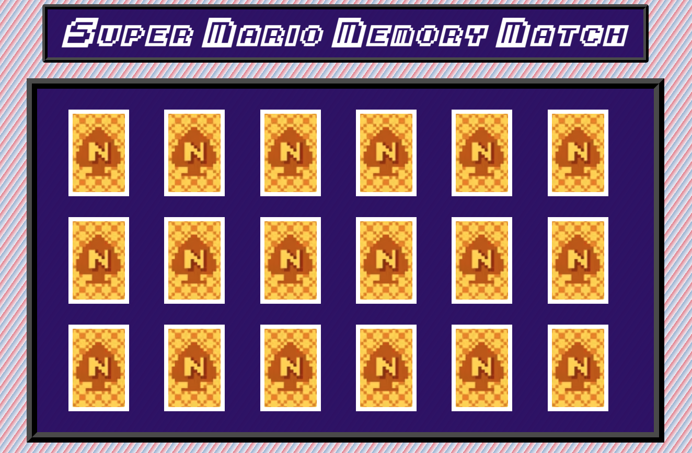

# Super Mario Memory Match

## How to play:

The goal is simple: flip over two of the same card until you finish the board! If you miss twice, you lose!

# [Play Now!](https://jessr90.github.io/super-mario-memory-match/)

## Motivation:

Super Mario Memory Match is my take on the classic version from the video game *Super Mario Brothers 3*. *Super Mario Brothers 3* was my favorite in *Super Mario All Stars* on Super Nintendo. It’s my favorite game of all time, and I’ve been playing it since I was five years old.

## Technologies Utilized:

* JavaScript
* CSS
* HTML
* Git and GitHub

## Attributions:
### Animations:

* Preloader tutorial
    * [YouTube](https://www.youtube.com/watch?v=s_hO8Pn3u5M&t=230s)

* Color Match Background
    * [Image Color Picker](https://imagecolorpicker.com/)

### Audio:

* Converted audio file MP4 to MP3:

    * [CloudConvert](https://cloudconvert.com/mp3-converter)

* If won - “Course Clear Fanfare, #2"
* If lost - “Game Over, #16"
* Card match - “Bonus game: Match”
* Card miss - “Bonus Game: No match” 

    * [Khinsider](https://downloads.khinsider.com/game-soundtracks/album/happy-mario-20th-super-mario-sound-collection)
* Chest match * Card Select - “1-Up”

    * [The Mushroom Kingdom](https://themushroomkingdom.net/media/smb3/wav)
* Background music - “N Spade, #17"

    * [Khinsider](https://downloads.khinsider.com/game-soundtracks/album/super-mario-bros.-3-1988-nes)

### Reference:

* The actual game being played:     
    * [YouTube](https://www.youtube.com/watch?v=vlTDP_5AYx4)
    
### Images:

* Card Front & Back Images
    * [Video Chums](https://videochums.com/article/super-mario-bros-3-n-spade-card-game-solutions)

* Favicon Image 
     * [Wikipedia](https://en.wikipedia.org/wiki/Super_Mario_Bros._3#/media/File:Super_Mario_Bros._3_coverart.png)

### Font:

* Super Mario Bros 3 Font
    * [Webfont Generator](https://www.fontsquirrel.com/tools/webfont-generator)

## Stretch Goals:

* Create an exact audio replica by downloading the audio from the game and slicing each bit for each action.

* Add confetti after a win.

* Animate the background to flash during a card match.

* Add a difficulty setting of Easy, Classic, and Hard.